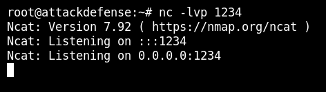
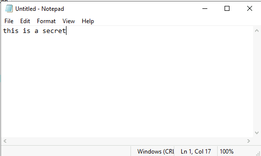
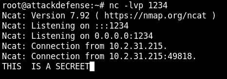

# INE-Penetration-Testing-Student

This is a collection of work done on the INE-Penetration Testing Student learning path(eJPT).

*Make sure to use  **-lws2_32** flag in your compiler.*

### Information stealer

It's a windows information stealer, sends the content of a file via a socket, it takes attacker IP, attacker listening port,  file name/path to send, respectively.

##### Demo:

Setting up a listener on the attacker machine and saving the output to a file:

Starting the app on the victim machine:

Screenshot of the file sent to the attacker:

### Keylogger

It is a keyboard logger, sends each pressed key on the keyboard to the attacker via a socket, only works on windows.

##### Demo:

Setting up a listener on the attacker machine:

After running the program, let's try to type something:

Let's see the result on the attacker machine:

